<picture>
  <source media="(prefers-color-scheme: dark)" srcset="./banner-dark.svg">
  <source media="(prefers-color-scheme: light)" srcset="./banner-light.svg">
  
</picture>

<h1 align="center">// 01 — whoami</h1>

<p align="center">
  <strong>Senior Full Stack & Blockchain Engineer</strong> with 3+ years shipping multi-chain Web3 in production. Based in Lahore — building across Ethereum, Solana, Bitcoin, TON, and Sui.
</p>

<p align="center">
  Currently at <strong>BigOSoft LLC</strong> and <strong>OYA Play</strong> — architecting smart contracts, DEX integrations, and AI-native on-chain systems. Work spans protocol infrastructure to user-facing dApps, always prioritizing security, performance, and cross-chain interoperability.
</p>

<h1 align="center">// 02 — identity.sol</h1>

```solidity
// SPDX-License-Identifier: MIT
pragma solidity ^0.8.19;

contract MuhammadImran {
    struct Profile {
        string   name;
        string   title;
        string   base;
        uint16   shippedSince;
        string   email;
        string   portfolio;
    }

    Profile public self = Profile({
        name:         "Muhammad Imran",
        title:        "Senior Blockchain Engineer",
        base:         "Lahore, Pakistan",
        shippedSince: 2023,
        email:        "imran94mustafa@gmail.com",
        portfolio:    "https://imran-portfolio-site.vercel.app/"
    });

    string[] public activeRoles = [
        "OYA Play       // since 2025.07",
        "BigOSoft LLC   // since 2024.09"
    ];

    string[] public focus = [
        "multi-chain protocol + dapp engineering",
        "ai-native web3 automation"
    ];

    function social() external pure returns (string memory, string memory) {
        return ("linkedin.com/in/imranmustafa030", "@imranmustafa030");
    }
}

// education: BS Computer Science · The University of Lahore · 2019–2023
```

<h1 align="center">// 03 — experience.log</h1>

```
◆ 2025.07 ─ present     OYA Play · Dubai, UAE
                        Senior Software Engineer

  ▸ Built an AI-native automation suite orchestrating Gemini, ElevenLabs,
    and MidJourney end to end — handling rate limits, failure modes, and
    latency budgets via streaming responses, async queues, and caching.
  ▸ Shipped a fully-automated Twitter posting platform driven from
    Telegram: admins and whitelisted members approve, reject, or edit
    AI-generated content and manage roles entirely from mobile.
  ▸ Delivered a real-time 3D animated AI agent with voice synthesis and
    live lip-sync, plus a voice-controlled Discord bot that captures
    meeting notes and executes admin commands hands-free during calls.

  ─── stack   TypeScript · Gemini · OpenAI · ElevenLabs · LangChain · WebRTC


◆ 2024.09 ─ present     BigOSoft LLC · Dover, DE
                        Senior Full Stack & Blockchain Developer

  ▸ Led DApp architecture across EVM and non-EVM networks — Ethereum,
    Solana, TON, Sui, Tron, Polygon, Arbitrum, Base, Optimism, BNB —
    owning sprint planning, code reviews, and release timelines.
  ▸ Built resilient event indexers, transaction queues, and WebSocket
    pipelines with automatic RPC failover; cut mainnet gas measurably
    via storage-layout restructuring.
  ▸ Engineered Telegram trading bots with DEX aggregator routing, token
    distribution systems, holder analytics with bubble-maps, and Jito
    bundlers packing 200+ ops per bundle for peak land rate.

  ─── stack   Solidity · Node.js · Next.js · Ethers.js · Jito · Jupiter · AWS


◆ 2024.01 ─ 2024.09     Softtik Technologies LLC · Milpitas, CA
                        Backend & Blockchain Developer

  ▸ Developed and hardened ERC-20/721/1155 contracts for DeFi and NFT
    clients — Hardhat, Foundry, fuzz + fork testing, gas profiling
    before mainnet deployment.
  ▸ Built Ethers.js/Web3.js integration layers with retry logic,
    nonce-safe queues, and RPC failover; powered NFT minting, staking
    dashboards, and DeFi tools with IPFS metadata + EIP-2981 royalties.
  ▸ Stood up Bitcoin Ordinals infrastructure — self-hosted full node
    plus Ord indexer — publishing inscriptions on-chain with zero
    third-party fees; benchmarked 10+ marketplaces on fees and timing.

  ─── stack   Solidity · Hardhat · Foundry · Bitcoin Core · Ord · IPFS


◆ 2023.03 ─ 2023.12     Kryptomind LLC · Dubai, UAE
                        Junior Blockchain Developer

  ▸ Built token systems, staking vaults, and automated reward
    distribution contracts across Ethereum and EVM chains, with
    OpenZeppelin as the security foundation.
  ▸ Optimized gas at the opcode level — storage packing, dead-code
    pruning, immutable variables — cutting deployment and per-call
    costs measurably across client contracts.
  ▸ Ran local + testnet suites via Remix, Truffle, Ganache, and
    Hardhat; verified deployments on Etherscan and BscScan with clean
    audit documentation.

  ─── stack   Solidity · Hardhat · Truffle · OpenZeppelin · Web3.js
```

<h1 align="center">// 04 — deployments</h1>

```
╔══════╦═════════════════════════╦══════════════════════════════════════════════════════════╗
║ TX   │ NAME                    │ DESCRIPTION                                              ║
╠══════╬═════════════════════════╬══════════════════════════════════════════════════════════╣
║ 0x01 │ KlipAi                  │ AI-powered Web3 wallet · EVM × Solana · $KLIP on BNB     ║
║ 0x02 │ Strike Bot              │ Telegram-native Solana trading bot · DEX aggregation     ║
║ 0x03 │ Modern Poker Club       │ Play-to-earn poker metaverse (Pokerverse) on Solana      ║
║ 0x04 │ Bitcoin Ordinals Infra  │ Self-hosted Bitcoin node + Ord indexer                   ║
║ 0x05 │ Review Crusher          │ AI reputation platform · 300+ review sites integrated    ║
║ 0x06 │ Group 351               │ Luxury chauffeur platform · 1,200+ customers · 4.7/5     ║
╚══════╩═════════════════════════╩══════════════════════════════════════════════════════════╝
```

<h1 align="center">// 05 — capabilities</h1>

```
languages            ▸  Solidity · TypeScript · JavaScript
chains (EVM)         ▸  Ethereum · Polygon · Arbitrum · Base · Optimism · BNB Chain
chains (non-EVM)     ▸  Solana · Bitcoin (Ordinals/BRC-20) · TON · Sui · Tron
standards            ▸  ERC-20 · ERC-721 · ERC-1155 · EIP-2981 · BRC-20
contracts            ▸  Hardhat · Foundry · OpenZeppelin · Slither · Ethers.js · Web3.js · TheGraph
solana               ▸  Jito · Jupiter
backend              ▸  Node.js · NestJS · Next.js · React · PostgreSQL · MongoDB · Redis · WebSockets
ai                   ▸  Gemini · OpenAI · ElevenLabs · MidJourney · LangChain
infra                ▸  AWS (EC2 · S3 · Lambda) · Docker · Coolify · Nginx · PM2 · GitHub Actions · Linux
```

<h1 align="center">// 06 — emit</h1>

```solidity
emit OpenForCollab({
    signal:    "Let's build the future of Web3 together",
    portfolio: "https://imran-portfolio-site.vercel.app/",
    linkedin:  "linkedin.com/in/imranmustafa030",
    twitter:   "@imranmustafa030",
    email:     "imran94mustafa@gmail.com"
});
```

<p align="center">
  <a href="https://imran-portfolio-site.vercel.app/">portfolio</a>
  &nbsp;·&nbsp;
  <a href="https://www.linkedin.com/in/imranmustafa030">linkedin</a>
  &nbsp;·&nbsp;
  <a href="https://twitter.com/imranmustafa030">twitter</a>
  &nbsp;·&nbsp;
  <a href="mailto:imran94mustafa@gmail.com">email</a>
</p>

<p align="center">
  <sub><code>// end of file</code></sub>
</p>
